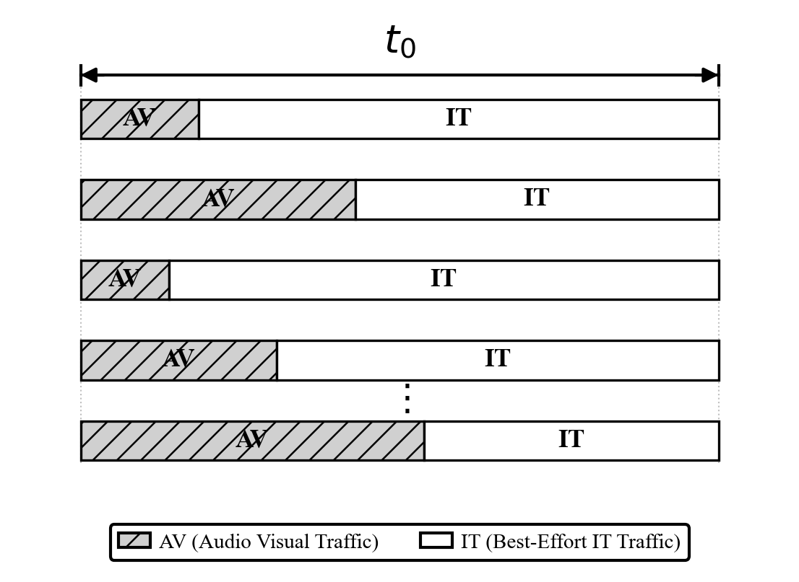
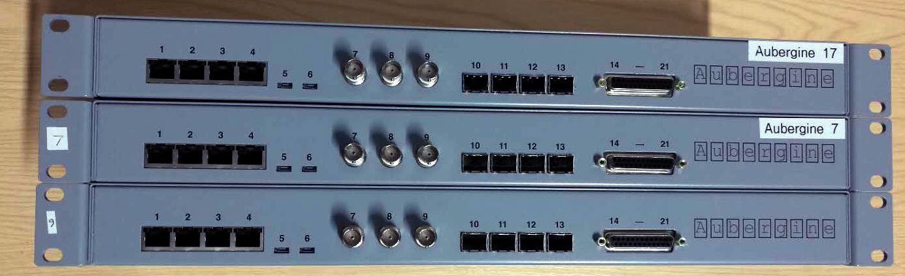
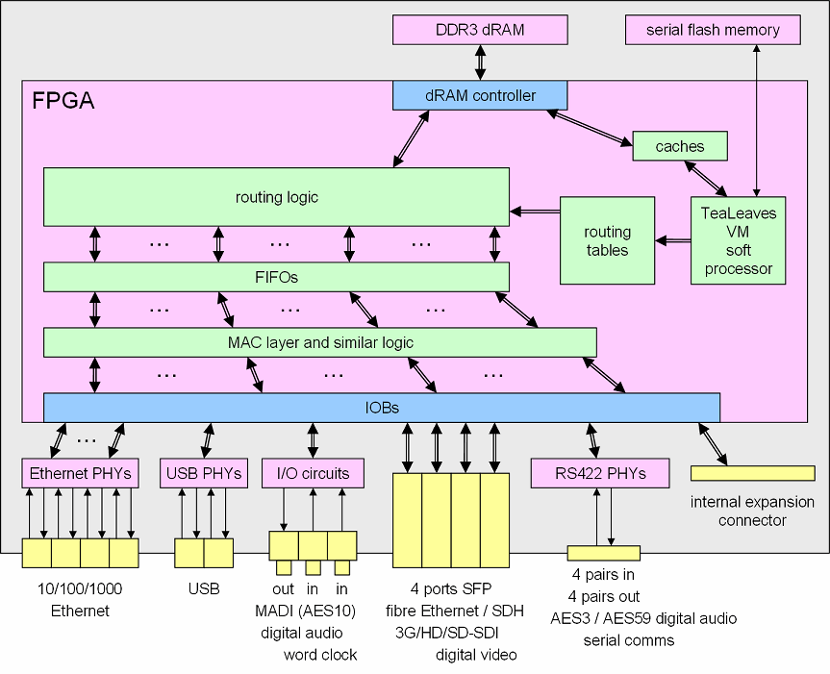
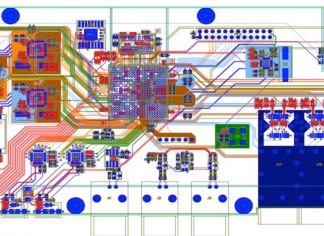
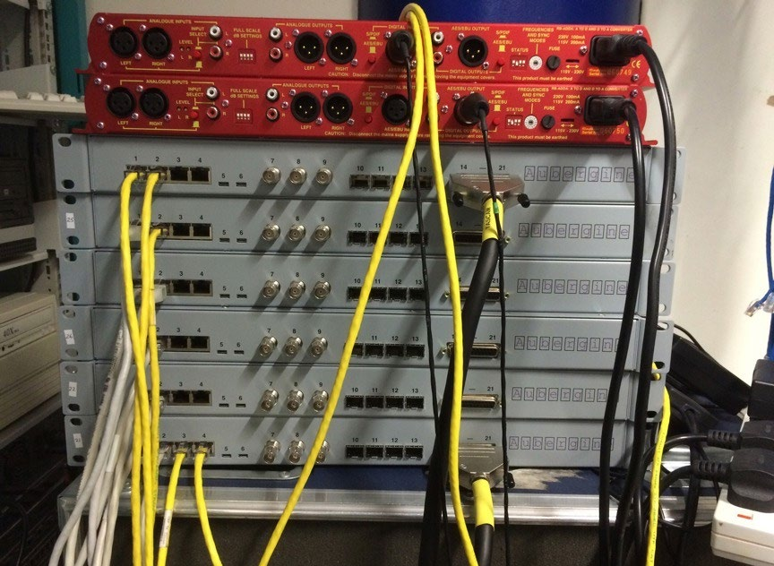

# Flexilink — Deterministic, Secure-by-Design Non-IP Networking

> **A clean-slate Layer 2/3 network architecture delivering guaranteed latency, security-by-design, and deterministic bandwidth for critical infrastructure.**

---

## What is Flexilink?

Flexilink is a **non-IP networking architecture** that replaces IP’s insecure best-effort forwarding model with a secure, authenticated, data plane that also offers a strictly deterministic and time-division-based service. Unlike TCP/IP — which was designed for resilient, best-effort communication — Flexilink is engineered from the ground up for systems where **latency guarantees, security, and predictability are non-negotiable**.

Layer 1 (the physical medium — fibres, cables, wireless) remains unchanged. Flexilink replaces Layers 2 and 3, while upper-layer application protocols continue to operate normally above it. Session establishment may evolve to take full advantage of the new guarantees offered.

### Technical lineage

Flexilink builds on early work from Nine Tiles' [Brunhilde system](http://www.ninetiles.com/Brunhilde.htm), which demonstrated coexistence of guaranteed real-time service and best-effort service on shared physical media. Flexilink extends this concept in a modern non-IP architecture. See this ([external source](http://www.ninetiles.com/docs/Flexilink_for_NGP_9.pdf), [local copy](docs/Presentation/Flexilink_for_NGP_9.pdf)) for more details of Flexilink as an evolution of AES51/ATM-era deterministic media networking that carries scheduled AV traffic and best-effort IT traffic on the same Ethernet link using slot-based framing.

### Why not just use IP?

IP networking carries fundamental design compromises that cannot be patched away:

| Property | IP / TCP | Flexilink |
|---|---|---|
| Forwarding model | Best-effort, variable latency | Assigned slots for time-critical traffic; Best effort for non-deterministic traffic |
| Security | Bolt-on (TLS, IPSec, firewalls) | Security-by-design at flow setup |
| Bandwidth waste | Header overhead, retransmissions | ≤1.6% overhead, no retransmissions |
| Attack surface | Large (routing table poisoning, DDoS, spoofing) | Minimal — no IP addresses, no ARP, no DHCP |
| Real-time suitability | Requires QoS workarounds (MPLS, TSN) | Native guaranteed service built in |

---

## Key Performance Figures

| Metric | Value |
|--------|-------|
| Minimum measured latency | **65 μs** (high-resolution audio) |
| Maximum bandwidth utilisation | **97.6%** |
| Guaranteed service overhead | **≤ 1.6%** |
| Allocation period range | **0.5 ms – 32 ms** (configurable) |
| Link speeds supported | **1 Gb/s** (current); 10 Gb/s planned, and others|
| Physical layer | Unchanged — runs over existing fibre/Ethernet/wireless (conditional) |

---

## Architecture

Flexilink separates network traffic into two services, carried simultaneously over the same link:

- **Guaranteed Service (AV: Audio Visual Traffic)** — time-division slots reserved at connection setup; deterministic delivery, fixed latency, used for audio, video, real-time control
- **Basic Service (IT: Best-Effort IT Traffic)** — best-effort traffic (legacy IP, management, low-priority data) carried in unused slot gaps

*Figure 1: Flexilink slot allocation over a fixed period t₀ — Guaranteed Service (AV: Audio Visual Traffic) is transmitted at a fixed rate with variable-length frames occupying reserved slots each period; Basic Service (IT: Best-Effort IT Traffic) fills the remaining available bandwidth slots.*

### How guaranteed slots work

Each allocation period (configurable, typically 1 ms at 1 Gb/s ≈ 1,952 slots) acts as a repeating schedule window. Reserved flows are assigned fixed slot positions that repeat every period. The router forwards each slot purely by its position — no per-packet address lookup, no congestion, no jitter.

## Hardware Prototype — The Aubergine Switch

Flexilink has been fully implemented and demonstrated on the **Aubergine** FPGA-based switching platform.

*Figure 2: Three Aubergine Flexilink switches (rack-mount, 1U) used in the BCU research laboratory.*

### Aubergine specifications

- **FPGA:** Xilinx Spartan 6 SLX45T
- **Ports:** 4× 1 Gb/s Ethernet, 4× SFP (fibre), 4× AES3 digital audio in/out, 1× AES10 (MADI, 64 channels), SDI video, word clock input
- **Soft CPU:** TeaLeaves VM4 — a 32-bit stack processor running in FPGA fabric
- **Management:** "IEC 62379 Common Control Interface

### FPGA Internal Architecture

*Figure 3: Aubergine FPGA block diagram — routing logic, per-port FIFOs, MAC layer, TeaLeaves VM soft processor, all within a single Spartan 6 FPGA.*

### PCB Layout

*Figure 4: Aubergine Flexilink switch PCB layout — the physical implementation of the Flexilink switching hardware, housing the Xilinx Spartan 6 FPGA, DDR3 memory, Ethernet/SFP interfaces, and AES3/AES10 audio I/O on a single board.*

### Laboratory Setup

*Figure 5: BCU laboratory rack — multiple Aubergine switches interconnected with AES3/AES10 professional audio equipment for live latency and determinism testing.*

---

## Applications

Flexilink is designed for any system where **determinism, security, and low latency** are critical requirements:

### Critical National Infrastructure (CNI)

- **Energy / Smart Grid** — IEC 61850 GOOSE/Sampled Values messages have ≤ 4 ms latency requirements; Flexilink's 1 ms allocation period meets this natively without QoS workarounds. Currently under investigation for UK distribution network operators (DNO) through an Innovate UK SIF bid.
- **Industrial control (OT/ICS)** — deterministic delivery eliminates timing uncertainty in SCADA and control loops
- **Remote surgery / tactile networking** — round-trip latency of < 1 ms demonstrated

### Professional Media

- **Live broadcast audio** — AES3/AES10 (MADI) transport with measured latency of 65 μs; demonstrated with up to 64-channel MADI
- **HD/4K video** — SDI transport at up to 3 Gb/s via SFP modules
- **Broadcast infrastructure** — directly replaces AES67 audio-over-IP with guaranteed delivery

### 5G / 6G Backbone and Wireless

- **DECT-2020 NR** — Flexilink over DECT-2020 wireless defined in ETSI GS NIN 004
- **Heterogeneous networks** — mobility handover with deterministic re-routing; wireless PHY integration defined

---

## Software-Defined Control — TeaLeaves and TeaLogics

The Flexilink control and forwarding functions are built with two distinct languages from the same language family:

- **TeaLeaves** defines software behaviour executed by the VM4 soft processor inside the FPGA (for example: routing updates, signalling, and admission control) without full FPGA recompilation
- **TeaLogics** shares the same core syntax but adds hardware-oriented constructs to describe FPGA implementations of VM internals and forwarding/data-plane functions
- A compiler toolchain can target either **VM4-executed code** or **synthesisable FPGA logic**, depending on which parts are best realized in software or hardware

The **Flexilink Controller** (Windows application) provides a graphical interface for configuring switches, monitoring flows, and viewing live network state.

---

## Standards & Collaboration

Flexilink is developed in close alignment with international standardisation:

| Standard |
|----------|
| **ISO/IEC 62379** |
| **ETSI GS NGP 013** |
| **ETSI GS NIN 005 Flexilink signalling** |

Collaboration enquiries are welcome from energy network operators, telecom providers, broadcast engineers, security researchers, and academic institutions.

---

## GitHub Organisation

All publicly available Flexilink materials are hosted under the [flexilink GitHub organisation](https://github.com/flexilink):

| Repository | Contents |
|------------|----------|
| [flexilink-controller](https://github.com/flexilink/flexilink-controller) | Windows Controller binaries (v2.1.2, v3.0.2, v3.1.0c), Controller C++ source, Wireshark plugin for Flexilink frame analysis |
| [flexilink-docs](https://github.com/flexilink/flexilink-docs) | Research documentation and technical project materials |
| [flexilink.github.io](https://github.com/flexilink/flexilink.github.io) | Source for this website |

### Relevant Standards documents

Published ETSI NIN relevant standards are available:

- [GR NIN 001](docs/standards/gr_NIN001v010101p.pdf) — Problem Statement
- [GR NIN 002](docs/standards/gr_NIN002v010101p.pdf) — Post-IP Networking
- [GR NIN 003](docs/standards/gr_NIN003v010101p.pdf) — Application-Aware Networks
- [GS NIN 005](docs/standards/gs_NIN005v010101p.pdf) — Terminology & Architecture *(normative)*
- [GS NIN 006](docs/standards/gs_NIN006v010101p.pdf) — Use Cases *(normative)*

---

## Selected Publications

1. Wang, Yonghao, John Grant, and Jeremy Foss. *Flexilink: A Unified Low Latency Network Architecture for Multichannel Live Audio*. AES Convention 133, 2012. [PDF](docs/papers/201210%20Flexilink%20A%20unified%20low%20latency%20network%20architecture%20for%20multichannel%20live%20audio.pdf)

2. Ma, T., Y. Wang, W. Hu, D. El-Banna, and K. Zhang. *Performance Evaluation of a New Flexible TDM Protocol on Mixed Traffic Types*. IEEE AINA, 2017. [PDF](docs/papers/201703%20AINA%20Performance%20Evaluation%20of%20a%20New%20Flexible%20Time%20Division%20Multiplexing%20Protocol%20on%20Mixed%20Traffic%20Types.pdf)

3. Ma, Tianao, Wei Hu, Yonghao Wang, Dalia El-Banna, John Grant, and Hongjun Dai. *Evaluation of Flexilink as Deterministic Unified Real-Time Protocol for Industrial Networks*. IEEE TrustCom/BigDataSE, 2018. [PDF](docs/papers/201808%20TrustCom%20Evaluation%20of%20Flexilink%20as%20Deterministic%20Unified%20Real-Time%20Protocol%20for%20Industrial%20Networks.pdf)

4. Ma, T., Y. Wang, W. Hu, D. El-Banna, and K. Zhang. *Evaluation of New Dynamic TDM Protocol for Real-Time Traffic over Converged Networks*. IEEE FiCloud, 2018. [PDF](docs/papers/201808%20FiCloud%20Evaluation%20of%20NewDynamic%20TimeDivision%20Multiplexing%20Protocol%20for%20Real-TimeTraffic%20overConvergedNetworks.pdf)

5. Guo, Yi, Jing Liu, Yonghao Wang, and Wei Hu. *Short Cycle Conversion Scheduling Model for Flexilink Architecture*. IEEE HPCC/SmartCity/DSS, 2019. [PDF](docs/papers/201908%20Short%20Cycle%20Conversion%20Scheduling%20Model%20forFlexilink%20Architecture.pdf)

6. Ma, Rongxuan, Yonghao Wang, Wei Hu, and Mahir Payyanil Karalakath. *Evaluation of Video Payload over Low Latency Networks: Flexilink*. International Journal of Parallel, Emergent and Distributed Systems 35(3), 2020. [PDF](docs/papers/201806%20Evaluation%20of%20video%20payload%20over%20low%20latency%20networks%20Flexilink.pdf)

---

## Recent Updates

- **April 2026** — New hardware development document published; FPGA platform expansion (Achronix, Microchip) under evaluation for next-generation switches.
- **March 2026** — Flexilink Controller v3.1.0c released; Controller source code and Wireshark plugin made publicly available.

---

## Contact

For collaboration, demonstrations, or technical briefings:

| | |
|---|---|
| **Dr Yonghao (Leo) Wang** | Birmingham City University |
| | [yonghao.wang@bcu.ac.uk](mailto:yonghao.wang@bcu.ac.uk) |
| **John Grant** | Nine Tiles, Cambridge — Inventor & Lead Engineer |
| | [j@ninetiles.com](mailto:j@ninetiles.com) |

- [Nine Tiles](http://www.ninetiles.com/) — Cambridge, UK
- [Birmingham City University](https://www.bcu.ac.uk) — Faculty of Computing
